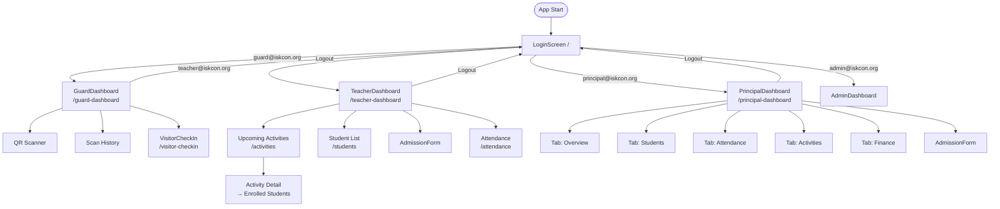
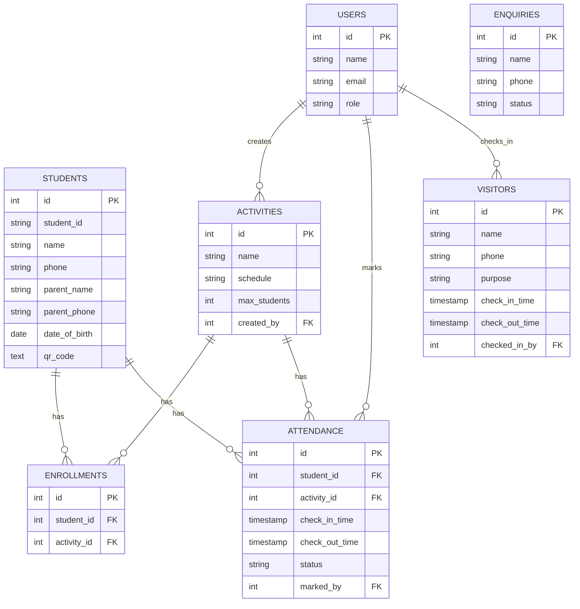
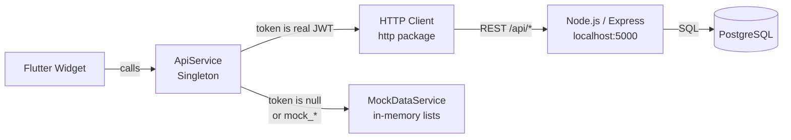
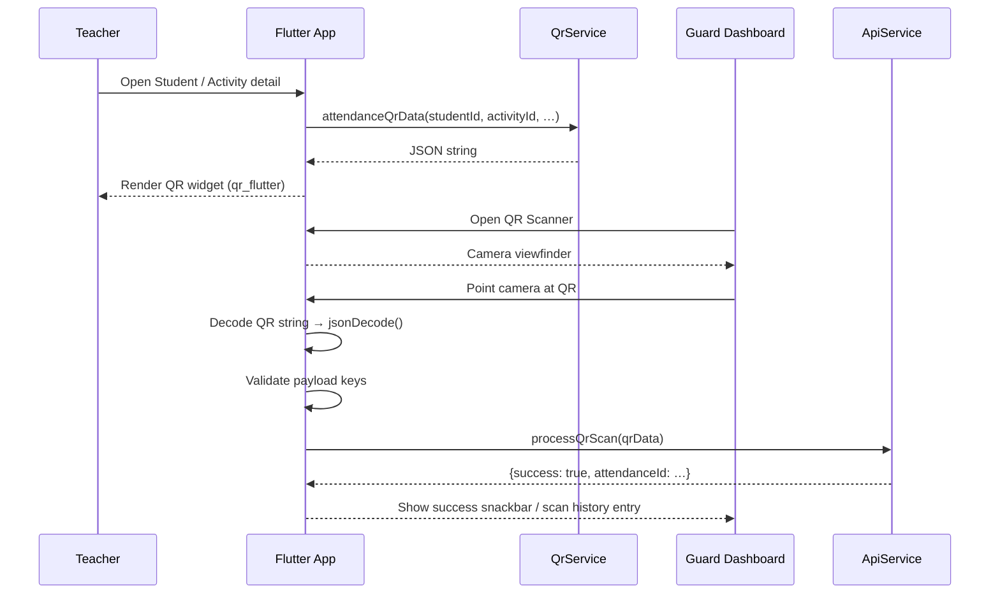
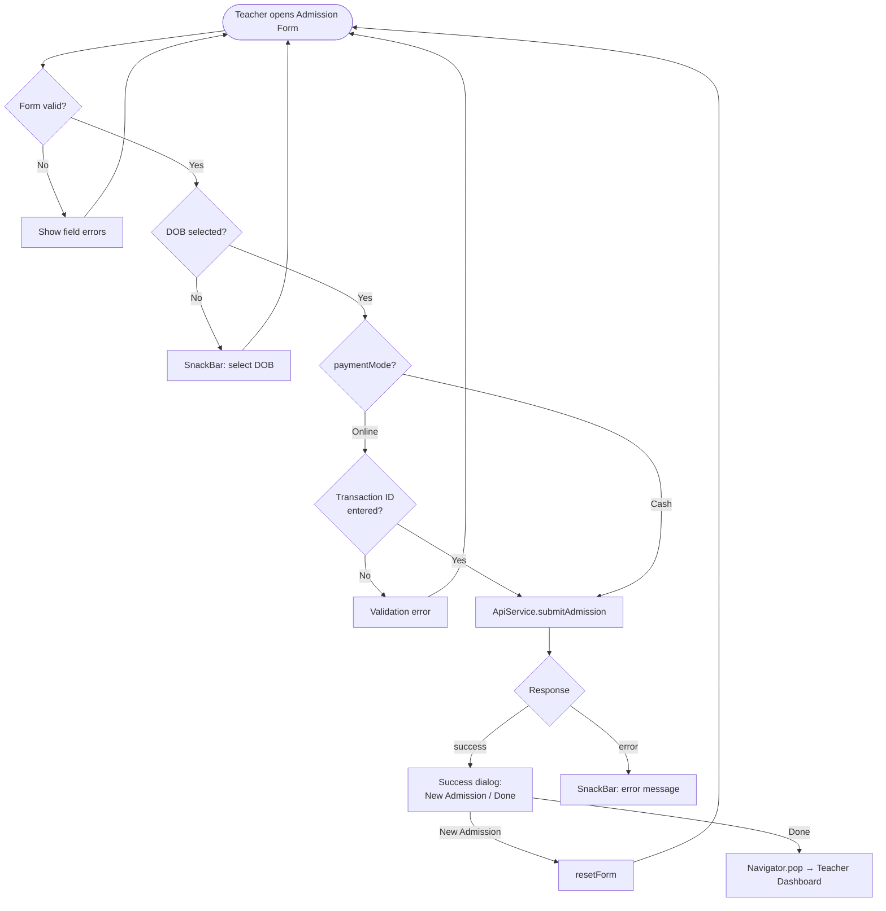
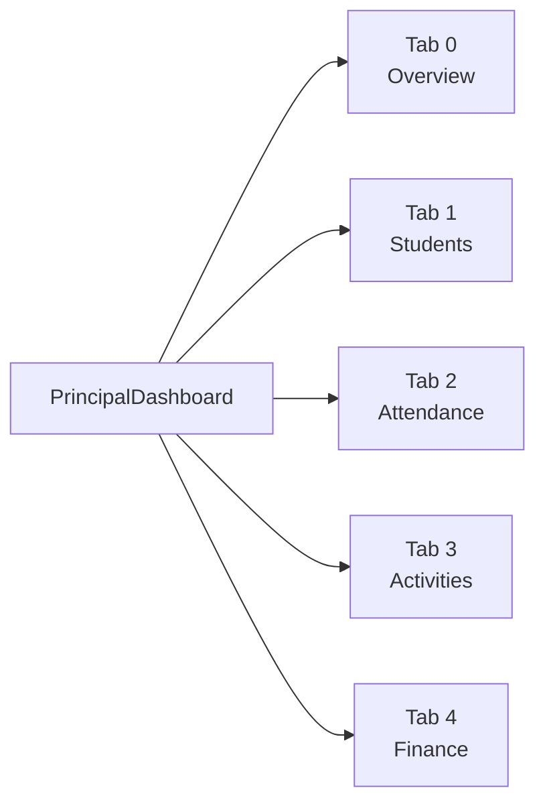
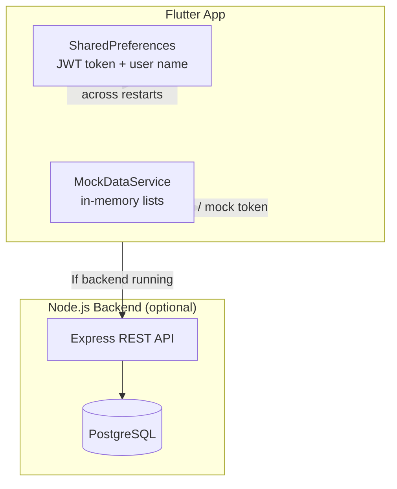

# ISKCON Activity Management — Architecture

## Table of Contents
1. [Project Overview](#1-project-overview)
2. [Folder Structure](#2-folder-structure)
3. [Role-Based Routing & Navigation](#3-role-based-routing--navigation)
4. [Data Models](#4-data-models)
5. [Services Layer (Mock API + Real Backend)](#5-services-layer-mock-api--real-backend)
6. [QR Generation & Scanning Flow](#6-qr-generation--scanning-flow)
7. [Admission Form Flow](#7-admission-form-flow)
8. [Principal Analytics Tabs](#8-principal-analytics-tabs)
9. [Current Persistence Strategy](#9-current-persistence-strategy)
10. [Backend Database Schema](#10-backend-database-schema)

---

## 1. Project Overview

ISKCON Activity Management is a **full-stack Flutter + Node.js** application for managing after-school activity programs at an ISKCON school. It supports three operational roles — Guard, Teacher, and Principal — each with a dedicated dashboard. The Flutter frontend can operate against a real PostgreSQL-backed Node.js/Express API or fall back to an in-app mock data layer when no backend is available.

| Layer | Technology |
|---|---|
| Mobile / Desktop UI | Flutter (Dart) |
| State / session | `shared_preferences` |
| QR display | `qr_flutter` |
| Backend API | Node.js 18 + Express 4 |
| Database | PostgreSQL 14+ (EOL for 11; 14+ recommended) |
| Auth | JWT + bcryptjs |

---

## 2. Folder Structure

```
iskcon_activity_management/
│
├── ARCHITECTURE.md              ← this document
├── README.md
├── .gitignore
│
├── flutter_app/                 ← Flutter application
│   ├── pubspec.yaml
│   └── lib/
│       ├── main.dart            ← app entry-point, MaterialApp + routing
│       ├── models/              ← plain Dart data classes (fromJson / toJson)
│       │   ├── user_model.dart
│       │   ├── student_model.dart
│       │   ├── activity_model.dart
│       │   ├── attendance_model.dart
│       │   └── visitor_model.dart
│       ├── navigation/
│       │   └── routes.dart      ← named-route table + generateRoute()
│       ├── screens/             ← one file per screen/page
│       │   ├── login_screen.dart
│       │   ├── guard_dashboard.dart
│       │   ├── teacher_dashboard.dart
│       │   ├── principal_dashboard.dart
│       │   ├── admin_dashboard.dart
│       │   ├── student_list_screen.dart
│       │   ├── activity_list_screen.dart
│       │   ├── attendance_screen.dart
│       │   ├── visitor_checkin_screen.dart
│       │   └── admission_form.dart
│       ├── services/            ← data-access layer
│       │   ├── api_service.dart        ← HTTP client + mock fallback
│       │   ├── mock_data_service.dart  ← 692-line in-memory dataset
│       │   └── qr_service.dart         ← QR payload builders
│       └── utils/
│           ├── constants.dart   ← colors, strings, base URL
│           └── theme.dart       ← Material 3 theme
│
├── backend/                     ← Node.js / Express API server
│   ├── server.js
│   ├── setup-db.js
│   ├── .env.example
│   ├── package.json
│   ├── config/
│   │   └── db.js                ← PostgreSQL Pool (node-postgres)
│   ├── controllers/             ← business logic, raw SQL queries
│   │   ├── authController.js
│   │   ├── studentController.js
│   │   ├── activityController.js
│   │   ├── attendanceController.js
│   │   ├── visitorController.js
│   │   ├── enquiryController.js
│   │   └── dashboardController.js
│   ├── routes/                  ← Express routers, one per resource
│   │   ├── auth.routes.js
│   │   ├── students.routes.js
│   │   ├── activities.routes.js
│   │   ├── attendance.routes.js
│   │   ├── visitors.routes.js
│   │   ├── enquiries.routes.js
│   │   └── dashboard.routes.js
│   ├── middleware/
│   │   ├── auth.middleware.js         ← JWT verification
│   │   ├── errorHandler.middleware.js ← global error handler
│   │   └── validation.middleware.js   ← input validators
│   ├── utils/
│   │   ├── jwt.js
│   │   ├── qrGenerator.js
│   │   ├── responses.js               ← standard {success,message,data}
│   │   └── validators.js
│   ├── database/
│   │   ├── schema.sql                 ← CREATE TABLE statements
│   │   ├── seed.sql                   ← sample data
│   │   └── init.sql
│   ├── API_DOCUMENTATION.md
│   └── TESTING_GUIDE.md
│
├── database/
│   └── verifySchema.sql
├── postman/                     ← Postman collection + environment
├── tests/                       ← Node.js integration tests
└── docs/
    └── TESTING_SETUP.md
```

---

## 3. Role-Based Routing & Navigation

### 3.1 Route Table (`lib/navigation/routes.dart`)

| Constant | Path | Screen |
|---|---|---|
| `login` | `/` | `LoginScreen` |
| `guardDashboard` | `/guard-dashboard` | `GuardDashboard` |
| `teacherDashboard` | `/teacher-dashboard` | `TeacherDashboard` |
| `principalDashboard` | `/principal-dashboard` | `PrincipalDashboard` |
| `studentList` | `/students` | `StudentListScreen` |
| `activityList` | `/activities` | `ActivityListScreen` |
| `attendance` | `/attendance` | `AttendanceScreen` |
| `visitorCheckIn` | `/visitor-checkin` | `VisitorCheckInScreen` |

### 3.2 Role-Guard Logic

After `ApiService().login()` returns a `UserModel`, `LoginScreen` inspects `user.role` and calls `Navigator.pushReplacementNamed()` with the appropriate named route. There is no named back-route from a dashboard to the login screen other than the explicit **Logout** action.

```
Login screen
  └─ role == 'guard'      → /guard-dashboard
  └─ role == 'teacher'    → /teacher-dashboard
  └─ role == 'principal'  → /principal-dashboard
  └─ role == 'admin'      → admin_dashboard (AdminDashboard widget)
```

### 3.3 Navigation Diagram



---

## 4. Data Models

All models live under `lib/models/` and follow the same pattern: a `const` constructor, a `fromJson(Map<String,dynamic>)` factory, and a `toJson()` method.

### 4.1 UserModel

```dart
// lib/models/user_model.dart
class UserModel {
  final int     id;
  final String  email;
  final String  name;
  final String  role;    // 'guard' | 'teacher' | 'principal' | 'admin'
  final String? token;

  bool get isAdmin     => role == 'admin';
  bool get isGuard     => role == 'guard';
  bool get isTeacher   => role == 'teacher';
  bool get isPrincipal => role == 'principal';
}
```

### 4.2 StudentModel

```dart
// lib/models/student_model.dart
class StudentModel {
  final int     id;
  final String  name;
  final String? email;
  final String? phone;
  final String? dateOfBirth;
  final String? parentName;
  final String? parentPhone;
  final String? address;
  final String? createdAt;
}
```

### 4.3 ActivityModel

```dart
// lib/models/activity_model.dart
class ActivityModel {
  final int     id;
  final String  name;
  final String? description;
  final String? schedule;
  final int?    capacity;
  final String? teacher;
  final String? ageGroup;
  final String? createdAt;
}
```

### 4.4 AttendanceModel

```dart
// lib/models/attendance_model.dart
class AttendanceModel {
  final int     id;
  final int     studentId;
  final int     activityId;
  final String? studentName;
  final String? activityName;
  final String? checkInTime;
  final String? checkOutTime;
  final String? createdAt;

  bool get isCheckedOut => checkOutTime != null;
}
```

### 4.5 VisitorModel

```dart
// lib/models/visitor_model.dart
class VisitorModel {
  final int     id;
  final String  visitorName;
  final String? visitorPhone;
  final String? visitReason;
  final String? studentName;
  final String? checkInTime;
  final String? checkOutTime;
  final String? createdAt;

  bool get isCheckedOut => checkOutTime != null;
}
```

### 4.6 Entity-Relationship Diagram



---

## 5. Services Layer (Mock API + Real Backend)

### 5.1 Architecture Overview



`ApiService` is a **singleton** (`factory ApiService()`) that:

1. Reads the stored JWT from `SharedPreferences` on every call.
2. If the token is `null`, empty, or prefixed with `mock_`, it delegates to `MockDataService` — no network call is made.
3. Otherwise it issues an authenticated HTTP request (15-second timeout, `Bearer` header) to the base URL defined in `AppConstants.baseUrl` (`http://127.0.0.1:5000/api`).

### 5.2 Mock Credentials

| Email | Password | Role |
|---|---|---|
| `guard@iskcon.org` | `Guard123` | guard |
| `teacher@iskcon.org` | `Teacher123` | teacher |
| `principal@iskcon.org` | `Principal123` | principal |
| `admin@iskcon.org` | `Admin@123` | admin |

### 5.3 API Surface

| Category | Method | Flutter call |
|---|---|---|
| Auth | POST /auth/login | `login(email, password)` |
| Auth | POST /auth/logout | `logout()` |
| Auth | GET /auth/me | `getCurrentUser()` |
| Students | GET /students | `getStudents()` |
| Students | GET /students/:id | `getStudent(id)` |
| Students | POST /students | `createStudent(data)` |
| Students | PUT /students/:id | `updateStudent(id, data)` |
| Students | DELETE /students/:id | `deleteStudent(id)` |
| Activities | GET /activities | `getActivities()` |
| Activities | GET /activities/:id/students | `getEnrolledStudents(id)` |
| Attendance | POST /attendance/checkin | `checkIn(studentId, activityId)` |
| Attendance | POST /attendance/qr-scan | `processQrScan(qrData)` |
| Attendance | GET /attendance/history | `getQrScanHistory()` |
| Dashboard | GET /dashboard/guard | `getGuardDashboard()` |
| Dashboard | GET /dashboard/teacher | `getTeacherDashboard()` |
| Dashboard | GET /dashboard/principal | `getPrincipalDashboard()` |
| Admissions | POST /enquiries | `submitAdmission(data)` |
| Visitors | POST /visitors/checkin | `visitorCheckIn(data)` |
| Visitors | PUT /visitors/:id/checkout | `visitorCheckOut(id)` |

### 5.4 Standard Response Envelope (Backend)

```json
{
  "success": true,
  "message": "OK",
  "statusCode": 200,
  "data": { ... }
}
```

Pagination responses add a `pagination` key alongside `data`.

### 5.5 Mock Data Catalogue (`MockDataService`)

| Collection | Count |
|---|---|
| Students | 22 (Arjun Sharma, Radha Patel, Krishna Kumar, …) |
| Activities | 10 (see full list below) |
| Attendance records | Several per student/activity |
| Visitors | Multiple with check-in/-out timestamps |

**10 activities defined in the system:**
1. Swimming  
2. Yoga  
3. Self-Defence  
4. Phonics  
5. Art & Craft  
6. Sanskrit  
7. Speech & Drama  
8. Indian Culture and Value for Kids  
9. Bharatanatyam  
10. Music & Movement  

---

## 6. QR Generation & Scanning Flow

### 6.1 QR Payload Types (`lib/services/qr_service.dart`)

| Method | `type` field | Key fields |
|---|---|---|
| `attendanceQrData()` | *(none)* | `studentId`, `studentName`, `activityId`, `activityName`, `timestamp` |
| `studentQrData()` | `"student"` | `id`, `name`, `phone?` |
| `activityQrData()` | `"activity"` | `id`, `name`, `schedule?` |
| `visitorQrData()` | `"visitor"` | `id`, `name`, `phone?`, `checkInTime` |

**Attendance payload example:**
```json
{
  "studentId": 12,
  "studentName": "Aarav Sharma",
  "activityId": 3,
  "activityName": "Self-Defence",
  "timestamp": "2026-03-18T10:20:30Z"
}
```

Payload is produced with `jsonEncode(map)` and rendered by the `qr_flutter` package.

### 6.2 QR Attendance Flow Diagram



---

## 7. Admission Form Flow

### 7.1 Fields Collected (`lib/screens/admission_form.dart`)

| Section | Field | Type | Validation |
|---|---|---|---|
| Personal | Student Name | Text | Required |
| Personal | Mother's Contact No | Phone | Required, 10 digits |
| Personal | Father's Contact No | Phone | Required, 10 digits |
| Personal | Date of Birth | Date picker | Required |
| Personal | School | Text | Required |
| Personal | Gender | Dropdown | Male / Female / Other |
| Discovery | How did you hear? | Dropdown | Friends / Social Media / Posters / Events |
| Payment | Payment Period | Radio chip | Monthly / Quarterly / Yearly |
| Payment | Payment Mode | Radio chip | Cash / **Online** |
| Payment | Transaction ID | Text | Required **only when Online** |

### 7.2 Conditional Logic

When `paymentMode == 'Online'`, the Transaction ID field appears dynamically (`if (_paymentMode == 'Online') ...` inside the widget tree) and its validator enforces a non-empty value.

### 7.3 Admission Submission Flow



---

## 8. Principal Analytics Tabs

`PrincipalDashboard` uses a `DefaultTabController` with **5 tabs** rendered via `TabBar` + `TabBarView`.



| Tab | Icon | Content |
|---|---|---|
| **Overview** | `dashboard` | KPI cards: total students, active activities, today's attendance, total visitors. Quick-action buttons (New Admission, View Reports). |
| **Students** | `people` | Searchable list of all students. Search bar filters by name in real-time (`_studentSearch` state variable). Tapping a student navigates to student detail. |
| **Attendance** | `bar_chart` | Attendance analytics: daily trend chart, activity-wise breakdown, summary table (present / absent / late counts). |
| **Activities** | `sports` | List of all 10 activities with enrollment counts. Tapping an activity shows enrolled students and schedule. |
| **Finance** | `payments` | Revenue summary by payment period (Monthly / Quarterly / Yearly), payment mode distribution (Cash vs Online), and pending payment flags. |

Data for all tabs is fetched once in `_loadData()` via `ApiService().getPrincipalDashboard()`, which returns a nested `Map<String, dynamic>`.

---

## 9. Current Persistence Strategy



| Storage | What is stored | Survives restart? |
|---|---|---|
| `SharedPreferences` | JWT auth token, current user name | ✅ Yes |
| `MockDataService` (in-memory) | Students, activities, admissions, attendance records added during session | ❌ No — reset on restart |
| PostgreSQL (backend) | All data when backend is running | ✅ Yes |

### Current State

- The app ships with a **fully functional mock data layer** so it can be demonstrated without a server.
- When the Node.js backend is started (`npm run dev` in `backend/`) and the Flutter app is pointed at its IP/port via `AppConstants.baseUrl`, all reads and writes go to **PostgreSQL** and persist permanently.
- The transition between mock and real is **automatic**: any non-mock JWT triggers real HTTP calls; clearing the token (logout) resets to mock mode on next login if credentials match the hardcoded mock list.

### Roadmap to Full Persistence

1. Run `node setup-db.js` to create PostgreSQL tables.
2. Set `BASE_URL` in `lib/utils/constants.dart` to the server address.
3. Log in with real credentials (seeded via `database/seed.sql`).
4. All admissions, attendance scans, and visitor check-ins will persist in the database.

---

## 10. Backend Database Schema

Seven tables with foreign-key relationships:

```
users ──────┐
            ├──> activities (created_by)
            ├──> attendance (marked_by)
            ├──> visitors   (checked_in_by)
            └──> enquiries  (assigned_to)

students ──> enrollments <── activities
students ──> attendance  <── activities
```

Key constraints:
- `enrollments(student_id, activity_id)` — UNIQUE, prevents duplicate enrollment.
- `attendance.status` — CHECK `('present', 'absent', 'late')`.
- `users.role` — CHECK `('admin', 'teacher', 'guard', 'principal')`.
- Performance indexes on `attendance(student_id)`, `attendance(check_in_time)`, `enrollments(student_id/activity_id)`.

Full DDL lives in `backend/database/schema.sql`.
