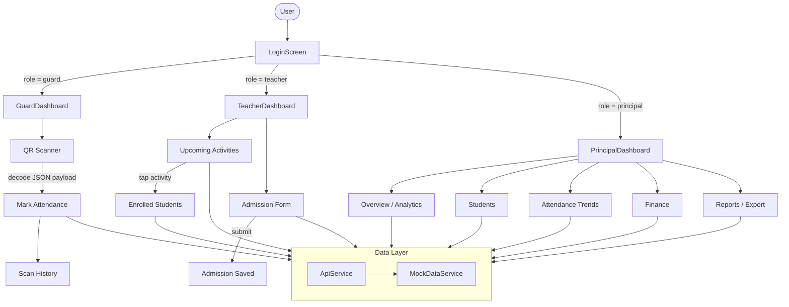

# ISKCON Activity Management – Architecture Diagram

## Flutter App Architecture

### Key layers

| Layer | Contents |
|---|---|
| **Presentation** | `screens/` – one folder per role; shared `widgets/` |
| **Navigation** | `navigation/` – role-based routing after login |
| **Domain** | `models/` – `User`, `Student`, `Activity`, `Admission`, `AttendanceRecord` |
| **Data** | `services/api_service.dart` → `services/mock_data_service.dart` (in-memory mock; no live DB yet) |
